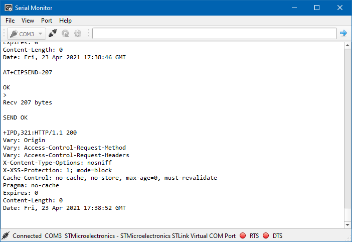

# Serial Monitor

Serial Monitor tool for embedded projects



## Features
* Connect to RS232 serial devices
* Read ASCII and binary data in hex format
* Send ASCII commands

## Build instructions
### Windows & Linux
* Install dependencies
  * [Qt](https://www.qt.io/) with QSerialPort library
  * QtCreator or other IDE that supports CMake
  * Clone the repository and open the terminal application in the project directory.
* Open project in your IDE compile and run

* Build on terminal
```bash
mkdir build
cd build
cmake -G Ninja ..
ninja
```
